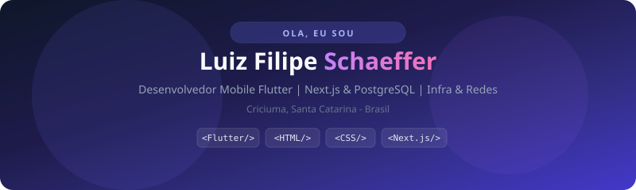
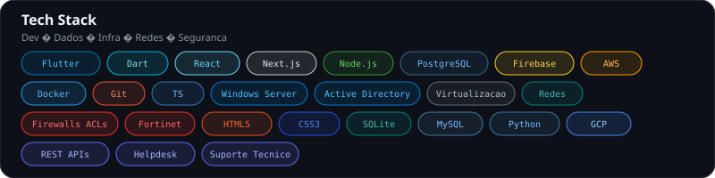
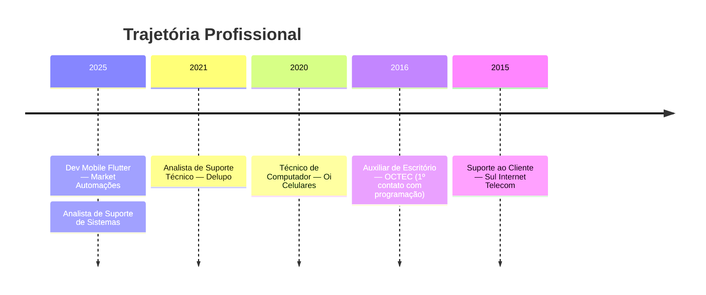

<!-- Hero: SVG nativo (compatível com GitHub) -->
<div align="center">



<br/><br/>

<!-- Typing SVG -->


<br/><br/>

<!-- Badges com HTML nativo -->
<p>
  <a href="https://luizfilipeschaeffer.dev/"></a>
  <a href="mailto:contato@luizfilipeschaeffer.dev"></a>
  <a href="https://wa.me/5548996846044"></a>
  <a href="https://www.linkedin.com/in/luizfilipeschaeffer"></a>
</p>

</div>

<!-- Stats: CSS Grid via SVG -->
<div align="center">
  
</div>

<br/>

---

## 👨‍💻 Sobre mim

<table>
<tr>
<td width="55%" valign="top">

Sou um profissional apaixonado por tecnologia, com **8+ anos** de experiência em suporte técnico e desenvolvimento. Especializado em **Flutter** — do conceito ao deploy — e em constante evolução rumo ao **fullstack**.

<br/>

**Atualmente:**
<ul>
  <li>📱 Desenvolvimento mobile com <kbd>Flutter</kbd> + <kbd>Firebase</kbd></li>
  <li>🌐 Interfaces web com <kbd>HTML</kbd> · <kbd>CSS</kbd> · <kbd>React</kbd></li>
  <li>🔧 Análise e suporte de sistemas empresariais</li>
</ul>

</td>
<td width="45%" valign="top">

```dart
class LuizFilipeSchaeffer {
  final String role = "Dev Mobile Flutter";
  final String goal = "Fullstack Developer";
  final int experience = 8;

  List<String> stack = [
    "Flutter", "Dart", "HTML/CSS",
    "React", "Node.js", "Firebase",
  ];
}
```

</td>
</tr>
</table>

---

## 🌐 Web & Frontend — HTML · CSS · JS

> Barras de progresso e chips renderizados em **SVG nativo** — compatível com o GitHub (sem `foreignObject`).

<div align="center">
  
</div>

<br/>

<div align="center">
  
</div>

<br/>

<details>
<summary><b>📱 Ver stack Mobile, Backend &amp; Infra</b></summary>
<br/>

<table>
<tr>
<td width="50%" valign="top">

**Mobile**
<br/>
<code>Flutter 90%</code> · <code>Dart 85%</code> · <code>SQLite 85%</code> · <code>Firebase 80%</code>

</td>
<td width="50%" valign="top">

**Backend & Cloud**
<br/>
<code>REST 70%</code> · <code>Node.js 65%</code> · <code>AWS 70%</code> · <code>Docker 60%</code>

</td>
</tr>
<tr>
<td valign="top">

**Banco de Dados**
<br/>
<code>SQLite 85%</code> · <code>MySQL 75%</code> · <code>PostgreSQL 70%</code>

</td>
<td valign="top">

**Suporte & Infra**
<br/>
<code>Suporte 95%</code> · <code>Helpdesk 90%</code> · <code>Servidores 85%</code> · <code>Redes 80%</code>

</td>
</tr>
</table>

</details>

---

## 💼 Experiência

<details open>
<summary><b>📋 Trajetória profissional completa</b></summary>
<br/>



<table>
<thead>
<tr>
<th align="left">Período</th>
<th align="left">Cargo</th>
<th align="left">Empresa</th>
</tr>
</thead>
<tbody>
<tr>
<td><code>fev/2025 — presente</code></td>
<td><b>Desenvolvedor de aplicativos móveis</b></td>
<td>Market Automações Ltda</td>
</tr>
<tr>
<td><code>nov/2024 — presente</code></td>
<td><b>Analista de suporte de sistemas</b></td>
<td>Market Automações Ltda</td>
</tr>
<tr>
<td><code>ago/2021 — abr/2024</code></td>
<td><b>Analista de suporte técnico</b></td>
<td>Delupo</td>
</tr>
<tr>
<td><code>fev/2020 — dez/2020</code></td>
<td><b>Técnico de computador</b></td>
<td>Oi Celulares e Informática</td>
</tr>
<tr>
<td><code>mar/2016 — jun/2016</code></td>
<td><b>Auxiliar de escritório</b></td>
<td>OCTEC Sistemas</td>
</tr>
<tr>
<td><code>jul/2015 — set/2015</code></td>
<td><b>Suporte ao cliente</b></td>
<td>Sul Internet Telecom</td>
</tr>
</tbody>
</table>

</details>

---

## 🎓 Formação & Certificações

<table>
<tr>
<td width="50%" valign="top">

<h3>🏫 Acadêmico</h3>
<ul>
  <li><b>Engenharia de Software</b> — UNIASSELVI<br/><sub>Conclusão prevista: set/2026</sub></li>
</ul>

</td>
<td width="50%" valign="top">

<h3>📜 Certificações</h3>
<ul>
  <li>Discover — Conectar</li>
  <li>Fortinet NSE 4</li>
  <li>AWS Cloud Computing (Iniciantes)</li>
  <li>SQL do ZERO ao Avançado</li>
  <li>Active Directory — Do Zero ao Avançado</li>
</ul>

</td>
</tr>
</table>

---

## 💡 Valores

<!-- Cards com CSS Grid + gradient top border -->
<div align="center">
  
</div>

---

## 📈 GitHub Stats

<div align="center">


</div>

---

## 🐍 Contribuições

<div align="center">

<!-- picture: dark/light mode nativo -->
<picture>
  <source media="(prefers-color-scheme: dark)" srcset="https://raw.githubusercontent.com/luizfilipeschaeffer/luizfilipeschaeffer/output/github-contribution-grid-snake-dark.svg"/>
  <source media="(prefers-color-scheme: light)" srcset="https://raw.githubusercontent.com/luizfilipeschaeffer/luizfilipeschaeffer/output/github-contribution-grid-snake.svg"/>
  
</picture>

</div>

---

## 🤝 Vamos conversar?

<!-- CTA com flexbox + gradiente via SVG -->
<div align="center">
  <a href="https://luizfilipeschaeffer.dev/">
    
  </a>
</div>

<br/>

<div align="center">

<p>
  <a href="https://wa.me/5548996846044"></a>
  <a href="mailto:contato@luizfilipeschaeffer.dev"></a>
</p>

<sub>📅 Seg–Sex · 9h–18h (GMT-3) · Resposta em até 24h</sub>

</div>

---

<div align="center">

<blockquote>
<i>"A tecnologia evolui constantemente — e eu evoluo junto."</i>
</blockquote>


<b>Feito com ❤️ em Criciúma — SC</b>

</div>

